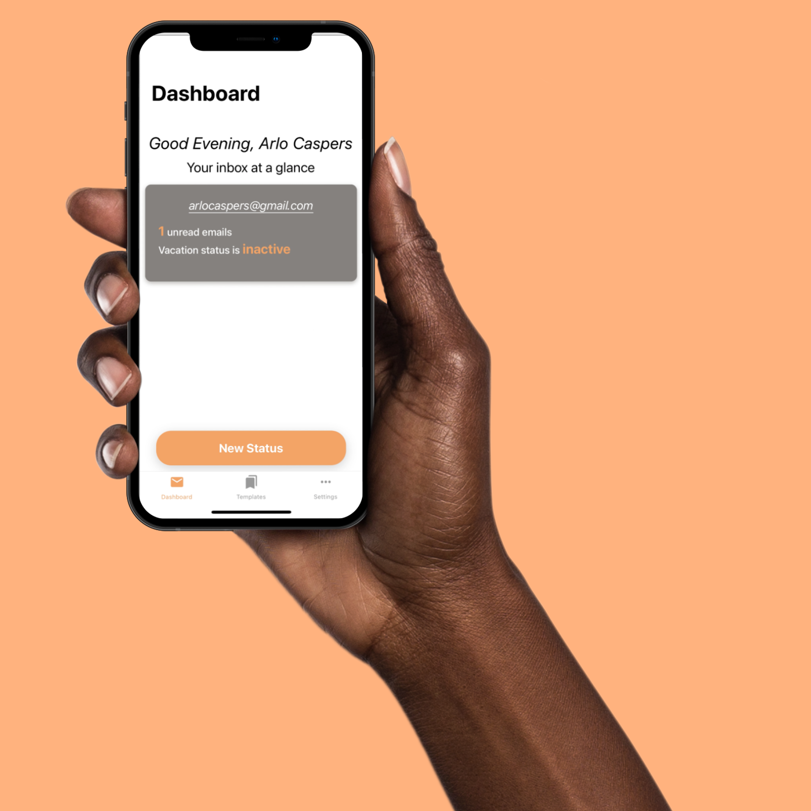
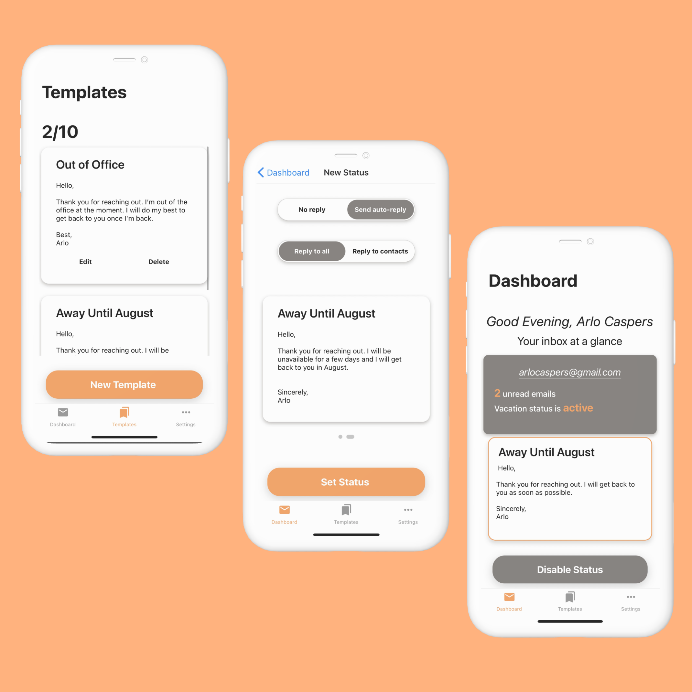

# Casper

## Stand out with your emails

> Nowadays, remote working has turned into a crucial part of our life. The line between personal and work gets blurry when you receive work emails in the middle of the night because your work spans over time zones or you’re putting the extra initiative for your business.
>
> It’s important to be able to easily, _and elegantly_, step away from your inbox when you need to. This is where Casper can help you. By keeping your most-used away messages you can with a few taps, gain a balance over when you want to answer your emails.

#### Creating Casper

**The important element when building Casper has been simplicity**

> I researched the ways a user can set a vacation status for their inbox. To make it as quick as possible, I chose a mobile application medium.

To make Casper I,

- designed wireframes and mockups using **Figma**
- used **Firebase** to easily authenticate users
- leveraged the **Gmail AP**I to access user’s to set vacation statuses
- developed a minimalistic application using **React-Native**
- deployed the backend in **Node.js** onto Firebase’s **cloud functions**

